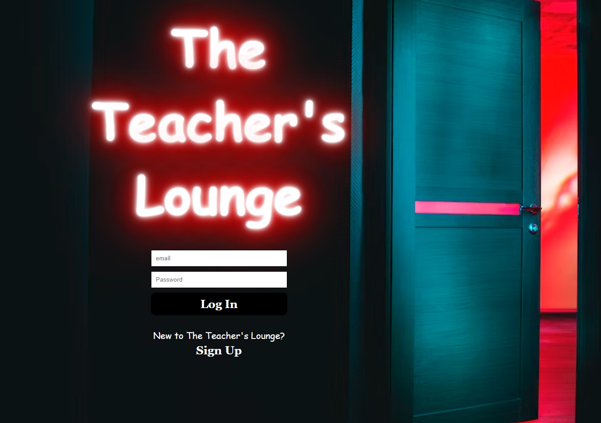

# The Teacher's Lounge

## Description

The Teacher's Lounge is known for being the most important room for educators. Here in The Teacher's Lounge you can relax, talk to other educators, discuss issues, and most of all socialize. With that being said, this app is designed for teacher's worldwide to gather and talk about their day whatever that may entail: "The good, the bad, and the downright UGLY." The Teacher's Lounge allows you to enter a username and gives you a random avatar for all your posts and comments made within the app. Have fun!

## Tech Stack
- MongoDB/Mongoose
- Express
- React
- Node
- CSS

## Upcoming Features

- Update Avatar to user for messaging
- Allow users to choose Lounge Rooms
- Create a Delete Modal 

## Github Repos and Sites 
- https://github.com/LatoyaHead/The-Teachers-Lounge.git
- https://github.com/LatoyaHead/The-Teachers-Lounge-API.git
- https://trello.com/b/ExtBl3uI/the-teachers-lounge
 